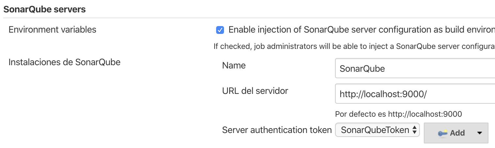
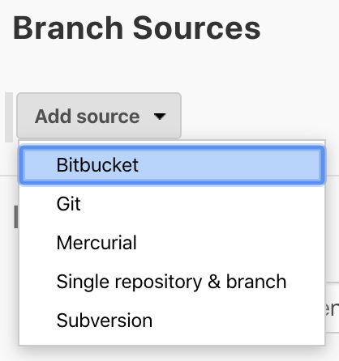

# Pull Request BitbucketCloud-Jenkins-Sonarqube

Comunicación entre BitbucketCloud, Jenkins y Sonarqube. Además de poder validar el porcentaje de cobertura y notificar el éxito o fallo del pipeline a Bitbucket en el Pull Request creado.

## Requerimientos

Para poder lograr el alcance mencionado se utilizó Docker, Jenkins, Sonarqube y BitbucketCloud.

## Configuración

### Docker

Descargar Docker Desktop Mac de la página web de [Docker](https://docs.docker.com/). Parala elaboración de este README se utilizó la versión para Mac.

### Jenkins
1. Abrir un terminal y obtener una imagen de Jenkins, la cual se puede encontrar en [Docker Hub](https://hub.docker.com/), en este caso hemos usado la última versión.

	```
	docker pull jenkins/jenkins
	```

2. Crear un contenedor de la imagen de Jenkins obtenida anteriormente. Establecer los puertos ha usar con el siguiente comando:

	```
	docker run -p 8080:8080 -p 50000:50000 <nombre-imagen>
	```

3. Abrir un navegador web e ingresar a `http://localhost:8080/`. Hasta este punto ya tenemos Jenkins corriendo.

#### Ngrok

Dado que el Jenkins se está ejecutando en la computadora de manera local este no será visible para otras herramientas y plataformas que estén en Internet.

Para solucionar esto usamos la herramienta [Ngrok](https://ngrok.com/download) la cual permite exponer a Internet un servidor web que se ejecute en la máquina local.

#### Estblecer Android SDK en el contenedor Jenkins

1. Entrar al contenedor creado previamente:

	```
	docker exec -u root -ti <nombre-contenedor> bash
	```

2. Actualizamos el repositorio:

	```
	apt-get update
	```
	
3. Entrar a la carpeta `jenkins_home`:

	```
	/cd /var/jenkins_home/
	```
	
4. Crear la carpeta `android-sdk`:

	```
	mkdir android-sdk
	```

5. Entrar a la carpeta creada:
	
	```
	cd /var/jenkins_home/android-sdk
	```

6. Descargar el `SDK tools` para Linux usando el utilitario `wget`:

	```
	wget https://dl.google.com/android/repository/sdk-tools-linux-4333796.zip
	```
7. Extraer el contenido:

	```
	unzip sdk-tools-linux-4333796.zip
	```

8. Entrar a la carpeta `bin`:

	```
	cd tools/bin/
	```

9. Crear el archivo `repositories.cfg`:

	```
	touch ~/.android/repositories.cfg
	```

10. Actualizar los SDK:
	
	```
	./sdkmanager —-update
	```

11. Ejecutar el siguiente comando y aceptar todas las licencias:
	
	```
	./sdkmanager --licenses
	```
	
12. Descargar la plataforma y build-tools de acuerdo a nuestro proyecto.
	
	```
	./sdkmanager "platforms;android-29" "build-tools;29.0.2" "extras;google;m2repository" "extras;android;m2repository"
	```
	
13. Con esto ya tenemos Android SDK instalado en el contenedor Jenkins. Finalmente ejecutar `exit` para salir del contenedor.

	```
	exit
	```
	
#### Establecer Android SDK en Jenkins

1. Se debe indicar la ruta del Android SDK. Ir a **Administrar Jenkins > Configurar el Sistema**.

	<p align="center">
	  <br>
	</p>

2. Buscar la sección **Propiedades globales** y habilitar la opción **Variables de entorno**. En **nombre** ingresar *ANDROID_HOME* y */var/jenkins_home/android-sdk* en **valor**.

	<p align="center">
	  <br>
	</p>

3. Finalmente hacer click en el botón **Guardar**.
	
### Sonarqube

1. Al igual que con Jenkins abrir un terminal y obtener la imagen oficial de Sonarqube.

	```
	docker pull sonarqube
	```
2. Crear el contenedor de la imagen obtenida en el paso previo.

	```
	docker run -d --name sonarqube -p 9000:9000 <nombre-imagen>
	```
3. Abrir un navegador y acceder a `http://localhost:9000/`.

#### Establecer Webhook en SonarQube

1. En la url del SonarQube ir a **Administration**, luego en **Configuration** presionar sobre este, aparecerá una lista de opciones, hacer click en **Webhooks**.

	<p align="center">
	  <br>
	</p>

2. Hacer click en el botón **Create**, ingresar el nombre que deseemos, en la sección **URL** ingresar *\<Jenkins-URL\>/sonarqube-webhook/* y hacer click en el botón **Create**.

	<p align="center">
	  <br>
	</p>

#### Establecer QualityGate en SonarQube

1. En SonarQube seleccionar la opción **Quality Gates** que se encuentra en la parte superior.

	<p align="center">
	  <br>
	</p>

2. Hacer click en **Create**, colocar un nombre y agregar las condiciones que se desea y finalmente seleccionar el proyecto que se será afectado por estas condiciones.

	<p align="center">
	  <br>
	</p>

#### Agregar SonarQube en Jenkins
Si deseamos reforzar la seguridad al no proporcionar las credenciales de un usuario real de Sonarqube se puede proporcionar un token de usuario como reemplazo de inicio de sesión del usuario. Esto aumentará la seguridad de la instalación al no permitir que la contraseña de un usuario viaje a traves de la red.

1. Primero, en SonarQube ir a **My Account** y luego hacer click en **Security**.

	<p align="center">
		  <br>
		</p>
		
2. Agregar un nombre para el token y hacer click en **Generate**, se mostrará un token el cual será usado en Jenkins para establecer el servidor de SonarQube.

3. Ir a **Administrar Jenkins > Administrar Plugins > Todos los plugins**, en la caja de **Filtrar** ingresar *SonarQube Scanner for Jenkins*.

	<p align="center">
	  <br>
	</p>

4. Se debe indicar el servidor SonarQube. Ir a **Administrar Jenkins > Configurar el Sistema**.
	
	<p align="center">
	  <br>
	</p>

5. Buscar la sección **SonarQube servers**, agregar el nombre, la url y el token de autenticación de nuestro servidor SonarQube.
	
	<p align="center">
	  <br>
	</p>

### Bitbucket Cloud
1. Ingresar a Bitbucket Cloud, crear o seleccionar el repositorio que se desee. Ingresar a la sección **Settings > Webhooks**, hacer click en **Add webhook**, ingresar un nombre para el webhook, en la **URL** ingresar *\<Jenkins-URL\>/bitbucket-scmsource-hook/notify* y seleccionar en qué acciones queremos que se notifique a Jenkins.

	<p align="center">
	  <br>
	</p>

2. Ahora en Jenkis, ir a **Administrar Jenkins > Administrar Plugins > Todos los plugins**, en la caja de **Filtrar** ingresar *Bitbucket Branch Source* y seleccionarlo, luego ingresar en la caja de texto e ingresar *Bitbucket Build Status Notifier* y hacer lo mismo.

	<p align="center">
	  <br>
	</p>
	
	<p align="center">
	  <br>
	</p>

	> El plugin *Bitbucket Build Status Notifier* este complemento está dirigido a BitBucket Cloud, no a BitBucket Server (anteriormente conocido como Stash).
	
	> Con este plugin podemos usar la función *bitbucketStatusNotify(buildState)* el cual acepta tres parametros `INPROGRESS `, `SUCCESSFUL` y `FAILED`.
	
	> Para mayor información visitar el [GitHub] (https://github.com/jenkinsci/bitbucket-build-status-notifier-plugin) del plugin.

#### OAuth en Bitbucket Cloud

Las integraciones de la API REST de Bitbucket Cloud pueden usar OAuth 2.0 para acceder a recursos en Bitbucket.

1. Ir a **Bitbucket settings**, dentro de la sección **ACCESS MANAGNEMENT** ir a **OAuth**.

	<p align="center">
	  <br>
	</p>

2. Ingresar un nombre para el **OAuth consumer**, en **Callback URL** ingresar la url del Jenkins.

	<p align="center">
	  <br>
	</p>

3. Marcar las opciones de lectura y escritura para repositorios y pull request.

	<p align="center">
	  <br>
	</p>
	
4. Luego en Jenkins ir a **Administrar Jenkins > Configurar el Sistema**. Buscar la sección **Bitbucket Build Status Notifier Plugin**, si no se tiene las credenciales guardadas anteriormente entonces dar click en el botón **Add** para agregar la credencial global.

	<p align="center">
	  <br>
	</p>

5. Seleccionar el tipo **Username with password**.

6. Establecer el **key** de OAuth consumer en **Username**.

7. Establecer el **secret** de OAuth consumer en **Password**.

8. Hacer click el botón **Add**.

9. En el combo box seleccionar la credencial guarda que se ha creado.

10. Finalmente hacer click en el botón **Guardar**.

## Implementación

### Multibranch Pipeline

1. En la página principal de Jenkins, hacer click e un **Nueva Tarea**.

	<p align="center">
	  <br>
	</p>

2. Seleccionar la opción **Multibranch Pipeline**.

	<p align="center">
	  <br>
	</p>

3. En la siguiente vista, ir a la sección **Branch Sources**. hacer click sobre el combo box **Add source** y seleccionar la opción **Bitbucket**.

	<p align="center">
	  <br>
	</p>

4. Agregar las credenciales, nombre de usuario de Bitbucket, luego se mostrará en el sección **Repository Name** los repositorios públicos que tengamos.

	<p align="center">
	  <br>
	</p>

2. Indicar la ruta del Jenkinsfile.

	<p align="center">
	  <br>
	</p>
3. Hacer click en el botón **Save**.

4. Se ejecutará por primera vez lo configurado y se mostrará una vista similar a la siguiente:

	<p align="center">
	  <br>
	</p>
	

### Jenkinsfile

Se creó un Jenkisfile con 4 stages (etapas): **Checkout**, **Build**, **Sonar** y **Quality Gate**.

<p align="center">
	<br>
</p>

* En el stage **Checkout** hacemos una llamada a **bitbucketStatusNotify(buildState: 'INPROGRESS')** para notificar el estado al repositorio.

	```
	stage('Checkout') {
	   steps {
	      bitbucketStatusNotify(buildState: 'INPROGRESS')
	      checkout scm
	   }
	}
	```

* En el stage **Build** corremos la aplicación Android.

	```
	stage('Build') {
	   steps {
	      sh "./gradlew assembleDebug --no-daemon"
	   }
	}
	```

* En el stage **Sonar** hacemos uso del bloque `withSonarQubeEnv` el cual recibe como parámetro el nombre del SonarQube.

	```
	stage('Sonar') {
	   steps {
	      withSonarQubeEnv("SonarQube") {
	         sh "./gradlew --info sonarqube --no-daemon"
	      }
	   }
	}
	```

* En el stage **Quality Gate**, la función `waitForQualityGate()` devuelve el estado del *quality gate*, si no se tiene el establecido en SonarQube se lanza un error.

	```
	stage("Quality Gate") {
	   steps {
	      script {
	         def qg = waitForQualityGate()
	         if (qg.status != 'OK') {
	            error "Pipeline aborted due to quality gate failure: ${qg.status}"
	         }
	      }
	   }
	}
	```

* Finalmente en el pipeline tenemos acciones post ejecución de stages para notificar el estado del pipeline al repositorio.

	```
	post {
	   success {
	      bitbucketStatusNotify(buildState: 'SUCCESSFUL')
	   }
	   
	   aborted {
	      bitbucketStatusNotify(buildState: 'FAILED')
	   }
	   
	   failure {
	      bitbucketStatusNotify(buildState: 'FAILED')
	   }
	}
	```